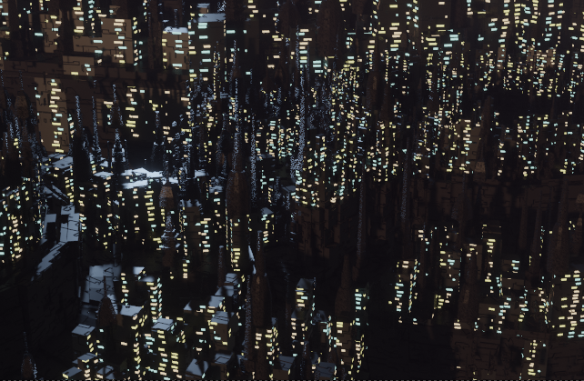

It's said that those who are forgotten return to this world as flowers. Fifth-type is set in the city of Verinn, a monstrous conurbation built on a superstructure sunk into the sea-bed. It expands ever-upwards as its lower reaches collapse into the ocean below. Dragons, lizardfolk and even sentient clouds live out their lives in its concrete warrens. Five years ago, devastating blackouts washed away all data in cyberspace.

Trigger is a man who does not know his own species. His memories begin during the blackouts, when he was found drifting near a wandering island which visits the mainland only twice in a millennium. Since then, he has been trying to crawl up through the city and into the light. Instead, Trigger falls to its lowest reaches, where the pressure crushes land-dwellers like a fist - to Atomos, the laboratory which studies the founding principles of this unkind world. There, he agrees to a dangerous experiment-ritual to awaken his dormant powers.

Kioki is a police detective, pushing through a tiresome day-job that only seems to expose her to the city’s most miserable subjects. A search for a missing person becomes a murder investigation when she discovers a mangled body in the city's flooded underbelly. Unable to plumb these depths alone, she seeks help from two old friends: men whose mortal bodies contain stranger souls. Tracking down her draconic suspect will lead Kioki on a path to a condemned facility that once swallowed someone precious to her. And all the while, the sea is rising.

Want to know more? You can reach out on me on X, or email me at morgan(dot)wodring(at)gmail(dot)com. Fifth-type is a completed manuscript and the first in a series of three, currently in the querying stage.
